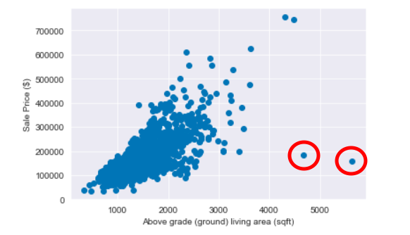
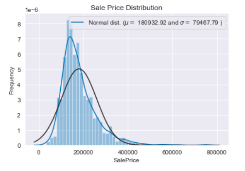
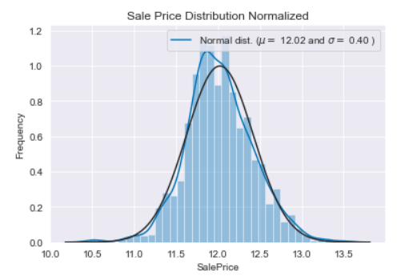

# House Price Prediction with Stacked Regression

The goal of this notebook is to predict house prices using a stacked regression method. 

## Data Processing
Like most ML projects, I started by doing some simple EDA on the training data. There were a few outliers when plotting sales price against living area and those outliers were removed without affecting the sample size. 

The target variable is skewed when visualized with a Q-Q plot. A logarithmic transformation was performed to standardize the data using numpy's log1p method. 

## Feature Engineering
There are a lot of missing data. In the data description,  NA denotes missing features, i.e., a pool or an alley. I plotted the number of missing values as a ratio of the total sample size to get a better idea of the features. Pool, misc features, alley, fence, and fireplace are missing more often than not. 

For rare structures, missing values most likely correspond to a nonexistent item. If there is no garage or basement, then there are no cars or basement properties.

Lot frontage is imputed from the median value of properties in the same neighborhood. A new feature 'total area' is created by summing the basement square footage, the first floor square footage, and the second floor footage.

Utility is a feature that has almost no variation, so it is dropped.

Categorical features with ordering are transformed with the LabelEncoder() method.

## Transform Skewed Features with Box Cox Transformation

Find all the features that are numerical types and use drop NA values to determine the skew. For features with a skew value above 0.75, the feature is transformed using scipy's boxcox1p method, which computes the Box-Cox transformation.

## Cross Validation

I shuffled the dataset prior to cross-validation since cross_val_score has no inherent shuffle attribute.

The evaluation metric I selected for this regression problem is Root Mean Squared Log Error. It has several advantages over the traditional RMSE evaluation metric:

1. Robustness to the effect of the outliers
2. RMSLE metric only considers the relative error between and the Predicted and the actual value and the scale of the error is not significant. On the other hand, RMSE value Increases in magnitude if the scale of error increases.
3. RMSLE incurs a larger penalty for the underestimation of the Actual variable than the Overestimation. More penalty is incurred when the predicted Value is less than the Actual Value. This is especially useful for business cases where the underestimation of the target variable is not acceptable but overestimation can be tolerated.

## Base Models

The base models used for this stacked regression problem are:
1. Lasso Regression
2. Elastic Net Regression
3. Kernel Ridge Regression
4. Gradient Boosting Regression
5. XGBoost
6. LightGBM

## Base Models Scores

For each base model, caculate the rmsle score using the validation set. The score standard deviation is in brackets.

- Lasso Regression score: 0.1115 (0.0074)
- Elastic Net Regression score: 0.1116 (0.0074)
- Kernel Ridge Regression score: 0.1153 (0.0075)
- GBoost score: 0.1167 (0.0083)
- XGBoost score: 0.1158 (0.0064)
- LightGBM score: 0.1167 (0.0059)

## Stacking Models using the Averaging Method

The stacking model is simply making clones of the original models and then taking the average of all the predictions. The result shows that a simple stacking model using the averaging method beats any individual models alone. 

Averaged base models score (std): 0.1087 (0.0077)

## Stacking Models using the Meta Model Method

The meta-model trains on the out-of-fold predictions of the base models, which are the out-of-fold predictions made on the holdout dataset during the resampling procedure. There is one prediction for each example in the training dataset. Then the out-of-folds predictions are used as the inputs, and the correct responses (target variable) are used as the outputs to train a higher level learner called meta-model.

For the prediction part, average the predictions of all base models on the test data and used them as meta-features on which, the final prediction is done with the meta-model.

Stacking Averaged models score: 0.1081 (0.0073)
RMSE on Entire Data: 0.0754

